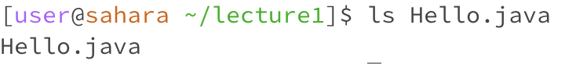
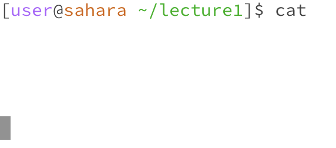
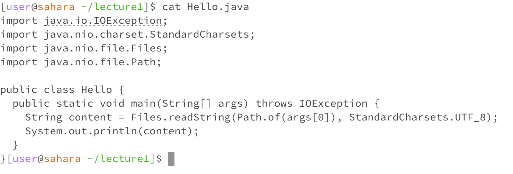

**Yichen Cai, A17349566**

# cd no arguments

The working directory is /home

I got the output because the function of the command cd is to change directory. Since I am already in the directory of /home, there is nothing changed although there is no argument.

It is not an error because there is no error message and the output shows that the command of cd functions rightly.

# cd directory

The working directory is /home

I got the output which is changing the directory to /home/lecture1 because the function of the command cd is change directory, and the argument as directory shows the targeting directory. 

It is not an error because it successfully change the working directory.

# cd file

The working directory is /home/lecture1

I got the output saying that the file HelloJava is not a directory.

It is an error because the command cd cannot used on a file, but only a directory.

# ls no argument

The working directory is /home/lecture1

I got a list of files and directory that is under the working directory, which is lecture1.

It is not an error because the command ls is used for getting a list of the directory. Since there is no argument, ls provides the list of file under current working directory.

# ls directory

The working directory is /home/lecture1

I got a list of files that is under the directory of my command, which is messages/.

It is not an error because the command run successfully, showing the list of files under the directory that I type for command.

# ls file

The working directory is /home/lecture1

I got the name of the file that is on the command line.

It is not an error in my opinion, but I think it is not a good use of the command. Since there is no error messages and it runs properly, however, it does not provide me useful outputs, but only the name of the file.

# cat no argument

The working directory is /home/lecture1

I got nothing but all blank. I cannot enter any other commands as well.

This is an error because the terminal stucks after I run the command without an argument. There is no output and the terminal runs forever with the blank. 

# cat directory

The working directory is /home/lecture1

I got a line said that my input directory is a directory.

It is not an error because it can runs well, however, it is not a good use too, since the command line does not provide useful information.

# cat file

The working directory is /home/lecture1

I got the exact context of the file that I command.

It is not an error since the command cat's purpose is to show the lines of the target file. And this line of command and output works properly.

