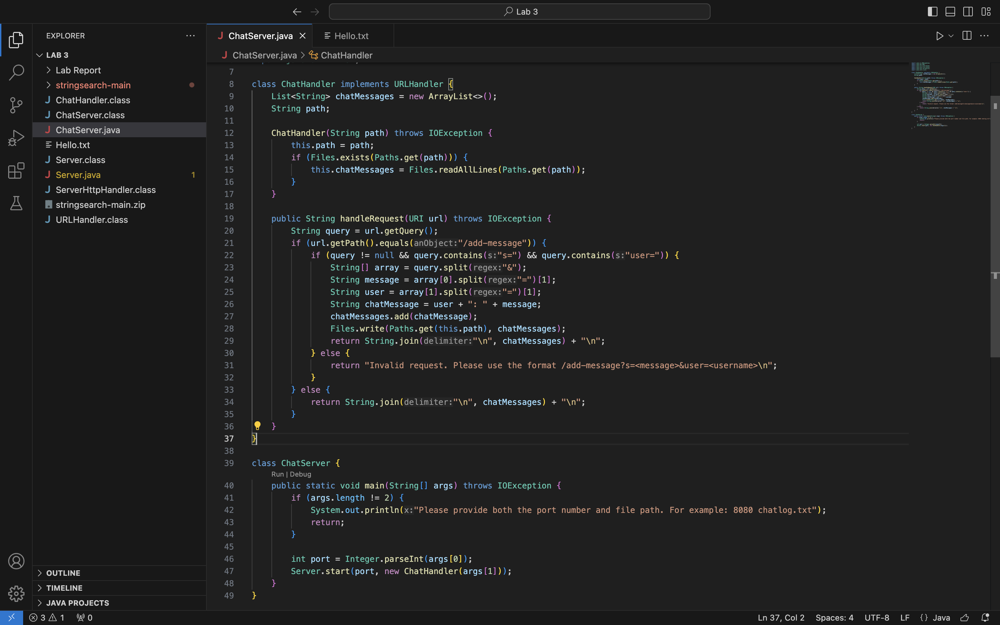
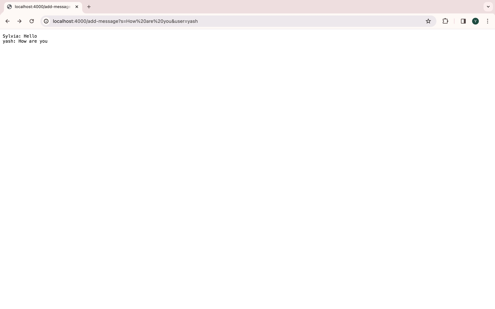
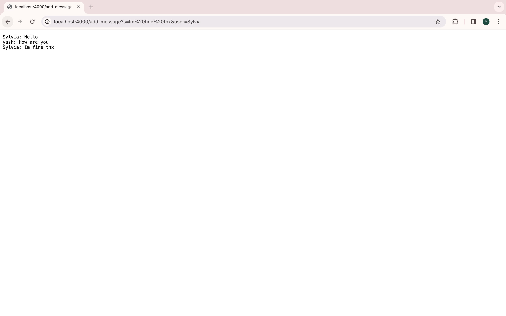
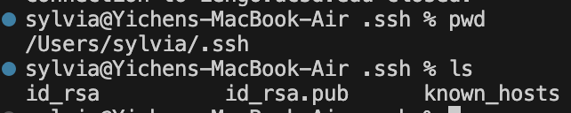

**Part 1**

Here is my code for the Chat Server.

I tried several times to see the function of the Chat Server.

For this line, I add /add-message?s=How%20are%20you&user=yash to the url. The method of handleRequest is used. In this method, when the argument is eqaul to /add-message, the program will pass the if statement and get into the next stage.

Then, the method will check the format of the command, whether it has the message and the user.

When the command is in the format of message and user, the method will first seperate the query into the message string, and the message object in this case is "How are you" and user name string, which is "yash".
 

Then, the method will combine them into the form of the output. In this case is the "yash: How are you".

Finally, prints the combined output onto the server and store it into the text file.

For this line, I add /add-message?s=Im%20fine%20thx&user=Sylvia to the end of the url. The same method is used, and the same logic is followed.

In this case, the method will seperate the command line into two strings, "Im fine thx" is the first one as message and "Sylvia" as the user name.

 Then, the combined output is "Sylvia: Im fine thx". This line is showed on the server as well as stored in the text file.

**Part 2**

The picture is the path of public keys, show by the command ls.

